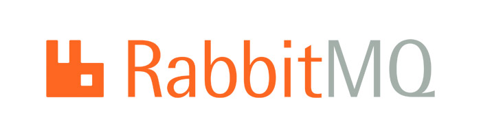

**This is an example of using rabbitMQ**

The idea is to have two producers that will share:
* one rabbitMQ server
* one exchange

but have two different queues for messages with two different routing keys.

The consumer is only one, it listens to the exchange and process each message in similar way.
So consumer needs to listen only one channel, but two queues.

**Advantages:**
- no need in additional work on rabbitMQ server;
- messages are not mixed;
- the cost is only one queue on the rabbitMQ server;
- only one channel for subscription.
